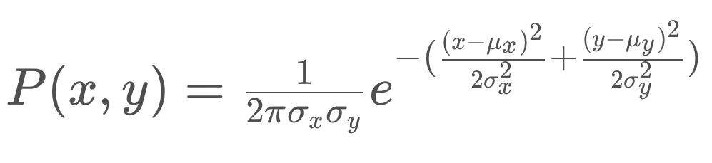
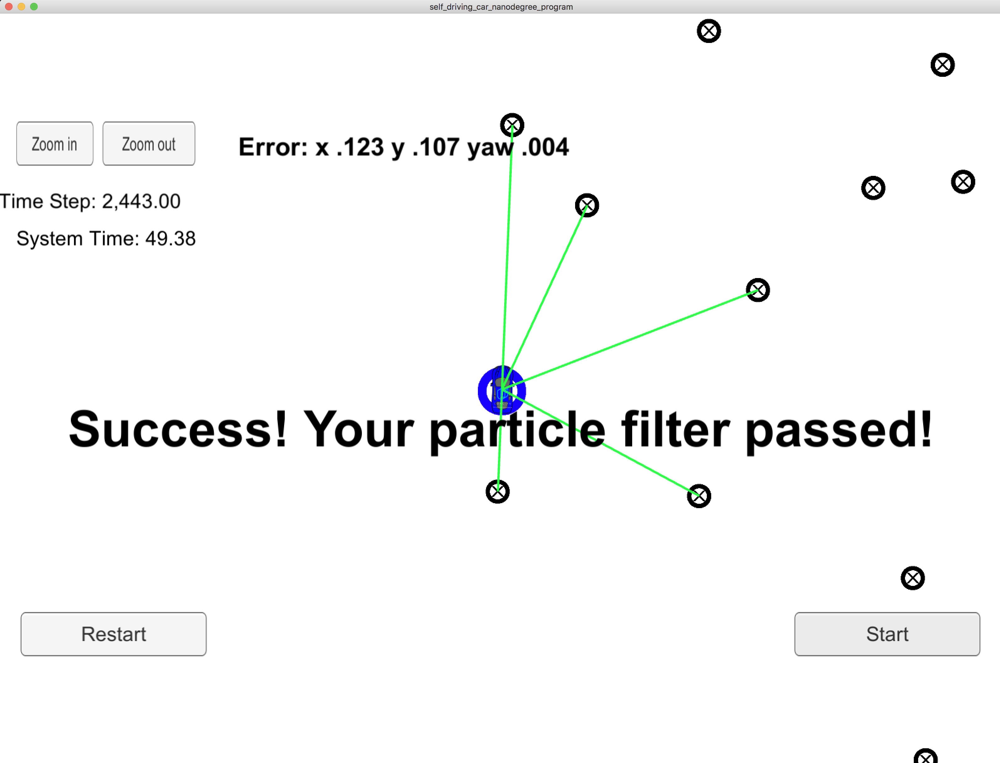

# Project Introduction
Robot car has been kidnapped and transported to a new location! Luckily it has a map of this location, a (noisy) GPS estimate of its initial location, and lots of (noisy) sensor and control data.

This project implement a 2 dimensional particle filter in C++. The particle filter will be given a map and some initial localization information (analogous to what a GPS would provide). At each time step, filter will also get observation and control data.

The purpose is to find car position in real time by observing landmark positions through particle filter.

# Solution
# Particle initialization:
    * initialize total random particle to be 50.
    * use GPS initial location to initial all particle adding the Gussian noise.
    * Each particle has initial weight of 1.0
# Prediction:
    Depending on the yaw rate, the particle's new position and direction is calculated as following fomula:
    if(yaw_rate == 0){
	   xf = x0 + v(dt)(cos(theta0));
	   yf = y0 + v(dt)(sin(theta0));
	   thetaf = theta0;
    }
    else{ // yaw_rate != 0
			// xf = x0 + v/thetadot*[sin(theta0 + thetadot * (dt) -sin(theta0)];
			// yf = y0 + v/thetadot * [ cos(theta0) - cos(theta0 + thetadot * dt)]
			// thetaf = theta0 + thetadot * dt
    }
    then add the Guassian noise to the predicted data.
# Particle weight update
For each particle, repeat the following step to update the weights.

* Given the noisey landmark by radar sample, first of all perform the co-ordinate translation from car co-ordinate to map system.
* for each translated observed landmark, find the closest landmark in the map co-ordinate system  using Euclidean distance between two 2D points
* calculate the weight for this particle by using multi-variate Gussian Distribution by following fomula for given observed landmark:
  
  in the fomula, the (x, y) is the translated observed landmark in the map co-ordinate system.
  ux and uy are position the landmark in map.
  sigma_x and sigma_ythe standard deviations
* multiply all weights for observed landmark.

# Resample
Now every particle has new weight, now resample same times as the original amount of particles to form new set of particle.
the weight of each particle determine the chance to be sampled.

# Result

The particle filter passed the criteria. the error between predicted position and ground truth is within given allowed range.
It takes 49.12s to complete 2443 step.
Error: 
x .121
y .108
yaw .004

### Running the Code
This project involves the Term 2 Simulator which can be downloaded [here](https://github.com/udacity/self-driving-car-sim/releases)

This repository includes two files that can be used to set up and intall uWebSocketIO for either Linux or Mac systems. For windows you can use either Docker, VMware, or even Windows 10 Bash on Ubuntu to install uWebSocketIO.

Once the install for uWebSocketIO is complete, the main program can be built and ran by doing the following from the project top directory.

1. mkdir build
2. cd build
3. cmake ..
4. make
5. ./particle_filter

